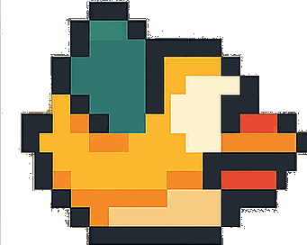

# Flappy Bird Pixel Art

A modern implementation of the classic Flappy Bird game using React, TypeScript, and SVG graphics.



## 🎮 Features

- Smooth and responsive gameplay
- SVG-based graphics for crisp visuals at any resolution
- Custom pixel art assets:
  - Animated bird sprite
  - Retro-style pipes
  - Parallax scrolling background
- Score tracking
- Game over screen with restart functionality

## 🚀 Technologies

- React
- TypeScript
- SVG Graphics
- Custom Hooks for game logic
- Vite for fast development and building

## 🛠️ Installation

1. Clone the repository:

```bash
git clone https://github.com/igormarcondes/pixel-art-flappy-bird
cd pixel-art-flappy-bird
```

2. Install dependencies:

```bash
npm install
```

3. Start the development server:

```bash
npm run dev
```

4. Open your browser and navigate to `http://localhost:5173`

## 🎯 How to Play

- Click or press any key to make the bird jump
- Navigate through the pipes without hitting them
- Each successful pipe passage awards one point
- Game ends when the bird hits a pipe or the ground
- Click to restart after game over

## 🏗️ Project Structure

```
src/
├── components/         # React components
│   ├── Bird.tsx       # Bird component and animation
│   ├── Pipes.tsx      # Pipe generation and movement
│   ├── Score.tsx      # Score display
│   └── GameOver.tsx   # Game over screen
├── hooks/             # Custom React hooks
│   ├── useGame.ts     # Game state and logic
│   ├── useGameLoop.ts # Game loop management
│   └── useKeyboard.ts # Keyboard input handling
├── types.ts           # TypeScript type definitions
└── constants.ts       # Game configuration constants
```

## 🎨 Assets

The game uses custom pixel art assets located in `public/assets/`:

- `flapy_bird.gif` - Animated bird sprite
- `pipe.png` - Pipe obstacle
- `bg.webp` - Scrolling background

## 🤝 Contributing

Contributions are welcome! Please feel free to submit a Pull Request.

## 🙏 Acknowledgments

- Original Flappy Bird game by Dong Nguyen
- React and TypeScript communities
- All contributors and players
